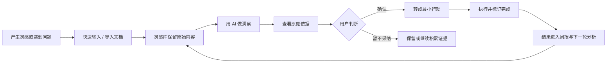
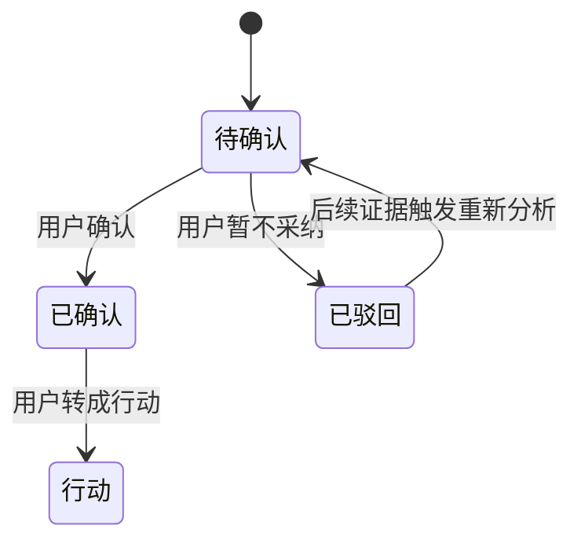
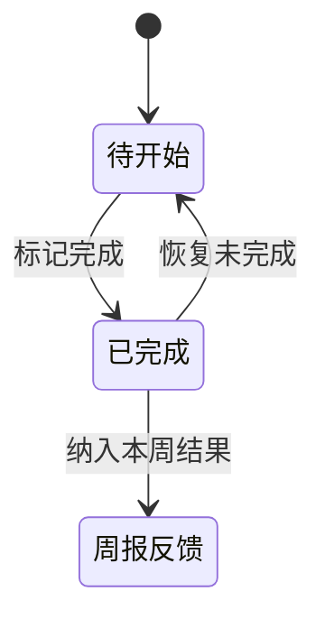

# Action 用户路径与功能架构

> 目标：说明用户为什么进入每个板块、具体点击什么，以及最终沉淀什么。

## 1. 核心行为闭环

这条路径的关键不是“AI 自动替用户做完”，而是每一轮都让用户拥有三个控制点：**是否采纳、是否行动、行动结果是否成立。**

## 2. 信息架构

| 一级板块 | 核心问题 | 主要对象 | 用户的关键动作 |
| --- | --- | --- | --- |
| 工作台 | 我现在最该处理什么？ | 当前行动、待确认洞察、最近输入 | 完成行动、去确认、继续记录 |
| 灵感库 | 我保存过什么？ | 手动记录、Word/PDF 文档 | 搜索、筛选、展开、沉淀、导入 |
| 洞察 | 这些内容说明了什么？ | AI 判断、证据、置信度 | 查看依据、确认、驳回、转行动 |
| 行动 | 我要做什么、做完了吗？ | 待开始和已完成行动 | 新建、打开、标记完成、恢复 |
| 周报 | 本周发生了什么变化？ | 输入、洞察、行动和下一步实验 | 查看依据、加入下周行动 |
| 产品方法 | 这个产品如何被设计？ | 产品案例与方法说明 | 浏览产品逻辑 |

## 3. 各板块设计说明

### 3.1 工作台

**作用：**把分散在其他页面的内容压缩成“今天要处理的三件事”，是执行入口，不是数据大屏。

**为什么这样设计：**用户每天打开产品时，不应该先面对完整历史，而应该先知道当前行动、最优先判断和最近输入。

**进入后的路径：**

1. 查看“今日推进”，打开最近一项未完成行动；
2. 点击完成控件，将结果写回行动状态；
3. 如果没有行动，点击“新建下一步”；
4. 查看“待确认洞察”，点击“查看依据”或“去确认”；
5. 查看最近输入，必要时进入灵感库继续整理。

**沉淀：**行动状态、洞察确认入口和最近活动，不单独创造新的业务数据。

### 3.2 灵感库

**作用：**统一保存手动输入和导入材料，是整个系统的事实来源。

**为什么这样设计：**AI 的长期价值依赖稳定的个人上下文，因此必须先建立一个不覆盖原话、可追溯的输入层。

**进入后的路径：**

1. 点击“快速输入”，选择灵感、观察、复盘或行动；
2. 填写标题、正文、标签和状态后保存；
3. 或点击“导入”，选择 Word 或 PDF；
4. 系统在浏览器解析 PDF 与 DOCX 正文；旧版 DOC 无法直接提取时降级为结构预解析，并生成摘要、关键词和内容卡片；
5. 在卡片堆叠中点击一张卡片，将其抽出展开；
6. 对文档点击“沉淀为灵感”，把材料中的信息转成可持续记录；
7. 使用搜索、类型筛选和排序快速定位内容。

**沉淀：**原始记录、文档元数据、解析文本、摘要、关键词和衍生卡片。

### 3.3 洞察

**作用：**从最近 14 天的多条内容中发现重复模式，并把 AI 判断交给用户确认。

**为什么这样设计：**AI 输出如果直接被当作事实，会造成误导；把“需要你确认”放在最高权重区域，可以明确人机边界。

**进入后的路径：**

1. 点击“用 AI 做洞察”；
2. 全局处理动画提示系统正在读取输入、识别模式和交叉验证；
3. 查看优先判断、置信度和说明；
4. 点击“查看依据”，检查原始记录或文档；
5. 点击“确认洞察”或“暂不采纳”；
6. 确认后点击“转成行动”；
7. 继续处理后续待确认判断，补充观察放在次要区域。

**沉淀：**结构化洞察、主题、证据引用、置信度、确认/驳回状态和反馈时间。人工判断会写回云端，并作为下一轮 AI 分析的上下文。

### 3.4 行动

**作用：**承接用户主动创建或由洞察转化的下一步，并记录结果。

**为什么这样设计：**洞察只有进入现实并得到反馈才有价值，因此行动页强调待开始、已完成和完成率，而不是复杂项目管理。

**进入后的路径：**

1. 点击“新建行动”，定义一个可验证的下一步；
2. 或从已确认洞察直接转入行动；
3. 点击行动卡片查看详情、编辑或删除；
4. 点击卡片上的状态胶囊标记完成；
5. 完成动画结束后回到行动列表；
6. 如误操作，可在已完成区恢复为未完成。

**沉淀：**行动内容、来源洞察、完成状态、完成时间、结果说明和结果类型（支持 / 不明确 / 不支持）。这些结果会进入下一轮洞察和周报。

### 3.5 周报

**作用：**把一周内容组织成“输入 → 判断 → 行动 → 下一步实验”的复盘地图。

**为什么这样设计：**周报不是一张固定图片，也不是输入流水账；它应该随着本周内容量和主题复杂度变化。

**进入后的路径：**

1. 选择本周实时简报或历史周报快照；
2. 从中心判断向四个分支阅读输入、关键洞察、行动结果和下周实验；
3. 点击原始依据，核查报告是否可信；
4. 点击“加入下周行动”，把实验带入下一轮。

**沉淀：**周起止日期、生成时的数据快照、动态布局、主题、摘要、行动反馈、趋势对比和下一步实验。

**当前生成机制：**云端模式下，用户运行 AI 分析后会同步生成或更新本周报告；页面也会随本地输入和行动状态实时重算展示。它目前不是每天定时后台自动生成。

### 3.6 全局 AI 对话

**作用：**允许用户围绕自己已有的记录追问，而不是提供一个无边界的通用聊天窗口。

**进入后的路径：**

1. 点击顶部“与 Action 对话”；
2. 输入问题；
3. 查看回答、引用依据和建议的最小下一步；
4. 根据需要转成行动或回到原始记录核查。

**沉淀：**当前版本不把聊天内容作为正式业务记录；只有用户主动转化或另行保存后才进入闭环。

## 4. 关键状态流

### 洞察状态

### 行动状态

## 5. 数据价值链

| 用户行为 | 写入的数据 | 后续价值 |
| --- | --- | --- |
| 保存灵感 | 原文、类型、标签、时间 | 形成个人上下文 |
| 导入文档 | 私有原文件、摘要、关键词、卡片 | 扩大可分析材料 |
| 运行洞察 | 主题、判断、证据、置信度 | 找到跨记录模式 |
| 确认或驳回 | 云端状态、决策时间和反馈记录 | 形成用户偏好与人类反馈，参与下一轮生成 |
| 转成行动 | 行动及来源 | 把判断带入现实 |
| 标记完成并回填结果 | 完成状态、结果类型、说明与完成时间 | 验证洞察是否可执行、是否得到现实支持 |
| 生成周报 | 周期报告和下一步实验 | 形成长期决策档案 |

## 6. 最短可用路径

新用户第一次体验不需要走完全部页面，最短路径是：

**注册/登录 → 快速输入 3 条相关内容 → 用 AI 做洞察 → 查看依据 → 确认 1 条 → 转成行动 → 标记完成 → 查看周报。**

这条路径既是产品首次体验路径，也是演示和后续漏斗埋点应围绕的主链路。
