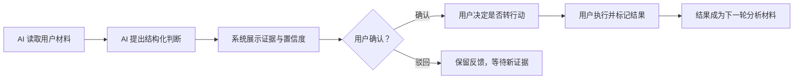

# Action AI 设计、评测与数据指标

> 这份文档回答三个问题：AI 在哪里真正创造价值、如何避免越权和幻觉、上线后用什么数据判断产品是否有效。

## 1. AI 在产品中的角色

Action 不把 AI 当作一个独立聊天页，而是把它放在三类需要认知加工的节点：

| AI 能力 | 输入 | 输出 | 用户控制点 |
| --- | --- | --- | --- |
| 洞察整理 | 最近 14 天的记录与文档 | 3 条结构化洞察、证据、置信度 | 查看依据、确认、驳回 |
| 引用式对话 | 用户问题、个人记录、洞察 | 回答、依据、可选下一步 | 是否采纳或转行动 |
| 动态周报 | 本周输入、洞察、行动结果 | 主题、摘要、动态布局、下周实验 | 核查依据、加入行动 |

AI 不负责：替用户做最终决定、自动标记行动完成、使用外部常识填补个人事实、覆盖用户原文。

## 2. 模型与调用架构

- 模型服务：DeepSeek；
- 当前模型：`deepseek-v4-flash`；
- 调用位置：Supabase Edge Functions；
- 密钥位置：Supabase Secrets，不进入浏览器；
- 鉴权方式：每次函数调用验证 Supabase 用户会话；
- 本地降级：未登录或未配置云端时，使用规则引擎展示完整工作流，但不宣称为真实大模型结论。

## 3. AI 输出契约

### 3.1 洞察

服务端要求模型返回 JSON，并在写入数据库前执行结构归一化和边界校验。

```json
{
  "insights": [
    {
      "id": "pattern",
      "label": "行为模式",
      "topic": "启动成本",
      "title": "判断",
      "detail": "解释",
      "evidence": 2,
      "confidence": 80,
      "accent": "#667d92",
      "evidence_refs": ["record-id"]
    }
  ]
}
```

校验规则：

- 最多取 3 条；
- `evidence` 转为非负整数；
- `confidence` 限制在 0-100；
- `accent` 必须为六位十六进制颜色，否则使用默认色板；
- `evidence_refs` 只能保存输入中存在的 ID；
- 无输入时直接返回空数组；
- 结构错误或空响应时不覆盖原有洞察。

### 3.2 引用式对话

```json
{
  "answer": "直接回答用户问题",
  "basis": "简述引用依据",
  "next_step": "一个可选的最小动作"
}
```

回答必须明确区分：

1. **原文事实：**用户记录中直接出现的内容；
2. **合理推断：**从多条内容归纳出的可能解释；
3. **待验证：**当前数据不足，需要更多输入或行动结果。

### 3.3 动态周报

周报输出包括：`theme`、`summary`、`topics`、`layout`、`explanation`、`action_feedback` 和 `next_experiment`。

布局只允许：

- `sparse`：输入较少，只保留核心判断和关键证据；
- `balanced`：标准信息量，呈现完整四分支；
- `dense`：输入较多，展开更多主题和证据样本。

## 4. 人机协作边界



关键防线：

- 数据防线：RLS 确保模型只读取当前用户内容；
- 生成防线：系统提示禁止把单条表达推断为稳定结论；
- 结构防线：严格 JSON 契约和服务端校验；
- 交互防线：AI 结果默认待确认；
- 反馈防线：用户可以确认或驳回，状态和决策时间写回云端，并作为下一轮分析上下文；
- 证据防线：洞察必须返回来源引用；
- 降级防线：失败时保留原内容和原洞察，不伪装成功。

## 5. AI 评测方案

### 5.1 离线评测集 `基础集已建立，持续扩充`

仓库已建立 6 组可自动校验的基础样本，覆盖空输入、弱证据、冲突表达、重复主题、提示注入和行动结果反馈；`npm run eval` 会校验输入、期望行为和安全约束。正式用户测试前仍应扩展到不少于 50 组匿名人工标注样本，每组包含 3-15 条记录和：

- 应该发现的主题；
- 不应该产生的过度推断；
- 正确证据 ID；
- 可接受的置信区间；
- 信息不足时的正确表达；
- 合理的最小行动。

样本需覆盖：同义重复、相互矛盾、单条强烈表达、无关记录混入、空输入、超长文档和中文口语。

### 5.2 核心质量指标

| 指标 | 定义 | 目标建议 | 当前状态 |
| --- | --- | --- | --- |
| JSON 有效率 | 可被服务端正常解析的响应占比 | ≥ 99% | 已做结构容错与契约回归，待线上持续统计 |
| 证据引用准确率 | 引用确实支持该洞察的比例 | ≥ 90% | 已有基础样本，待扩展人工标注集 |
| 无依据推断率 | 缺少输入支持的结论比例 | ≤ 5% | 已有空输入/弱证据护栏，待扩展人工标注集 |
| 洞察去重率 | 3 条洞察之间不重复的比例 | ≥ 95% | 未持续统计 |
| 空状态正确率 | 无数据时不生成虚构结果 | 100% | 已实现空返回逻辑 |
| 最小行动可执行率 | 用户认为能在限定时间开始的建议比例 | ≥ 80% | 待用户测试 |
| 周报事实一致率 | 报告数字和内容与源数据一致 | ≥ 99% | 动态字段与历史快照已实现，待规模化回归集 |

### 5.3 人工评审量表

每条洞察由评审者按 1-5 分打分：

1. **相关性：**是否回答了这组记录真正反复出现的问题；
2. **可追溯性：**是否能从引用内容直接看出判断来源；
3. **克制性：**是否避免把可能性说成事实；
4. **可行动性：**是否能自然转成一个可执行实验；
5. **表达质量：**是否简洁、清楚、没有重复套话。

上线门槛建议：平均分不低于 4.0，且可追溯性不得低于 3 分。

### 5.4 在线护栏

- Edge Function 错误率；
- P50/P95 生成耗时；
- 每次成功生成的平均 token 与费用；
- 用户点击“暂不采纳”的比例；
- 用户查看依据后驳回的比例；
- 已确认洞察在 24 小时内被撤回的比例；
- AI 建议被转为行动后又立即删除的比例。

## 6. 产品数据指标

> 以下事件已写入用户隔离的云端分析表，并提供按日漏斗聚合视图；当前没有足够真实用户数据，因此不是业务成绩。

### 6.1 北极星指标

**每周被确认并进入行动的洞察数（Weekly Insight-to-Action）。**

它要求用户先提供真实输入、AI 产生有效判断、用户愿意确认，并最终形成行动，能够代表核心闭环是否成立。

### 6.2 漏斗指标

| 阶段 | 事件建议 | 转化定义 |
| --- | --- | --- |
| 激活 | `first_input_saved` | 注册后 24 小时内保存首条输入 |
| 上下文形成 | `third_source_added` | 累计至少 3 条记录/文档 |
| AI 使用 | `insight_analysis_completed` | 成功生成洞察 |
| 信任建立 | `insight_evidence_opened` | 至少查看 1 次依据 |
| 判断形成 | `insight_confirmed` | 确认至少 1 条洞察 |
| 行动转化 | `insight_converted_to_action` | 确认洞察进入行动 |
| 结果形成 | `action_completed` | 至少完成 1 个行动 |
| 周期复盘 | `weekly_report_viewed` | 查看本周报告 |

### 6.3 留存与价值指标

- 次周仍新增输入的用户比例；
- 连续两周至少确认一次洞察的用户比例；
- 连续两周至少完成一次行动的用户比例；
- 每周有证据的洞察数；
- 洞察到行动的中位用时；
- 行动完成后再次打开周报的比例。

### 6.4 护栏指标

- 错误证据举报率；
- 洞察驳回率异常升高；
- 行动撤销率；
- AI 调用失败率；
- 注册邮件未送达率；
- 文档解析失败率；
- 用户删除全部数据或退出的比例。

## 7. 已实现的埋点最小方案

第一阶段不需要一次性埋几十个事件，先覆盖主链路：

```text
auth_completed
first_input_saved
source_saved
document_imported
third_source_added
insight_analysis_started
insight_analysis_completed
insight_analysis_failed
insight_evidence_opened
insight_confirmed
insight_rejected
insight_converted_to_action
action_completed
action_result_saved
weekly_report_viewed
product_feedback_submitted
```

每个事件只附带必要属性：用户匿名 ID、时间、页面、来源类型、洞察 ID、行动 ID、成功/失败和耗时。不要把用户正文直接写入分析日志。

## 8. 当前验证结论

### 已验证

- DeepSeek 能返回符合中文结构化要求的洞察样例；
- 服务端支持洞察、周报和引用式问答三类调用；
- 无输入时洞察函数返回空数组；
- 模型密钥在服务端，浏览器和仓库不含私密 Key；
- 页面在云端失败时会保留原有内容并提示降级。
- 洞察确认/驳回状态会云端持久化，并参与下一轮分析；
- 行动结果会结构化保存，并进入洞察和周报；
- 6 组基础 AI 安全与质量样本可通过 `npm run eval` 自动回归；
- 主链路行为事件、产品反馈和按日漏斗聚合已经部署。

### 尚未验证完整

- 基于真实用户长期数据的洞察准确率；
- 真实邮箱新用户从验证到跨设备同步的长期稳定性；
- 50 组以上人工标注样本上的引用准确率和无依据推断率；
- 邮箱服务在大规模发送下的送达率；
- 不同文档格式和超长材料的稳定解析；
- AI 建议是否真实提升行动完成率和次周留存。

面试或对外介绍时，应把“技术链路已跑通”和“产品价值已被市场验证”明确区分。
