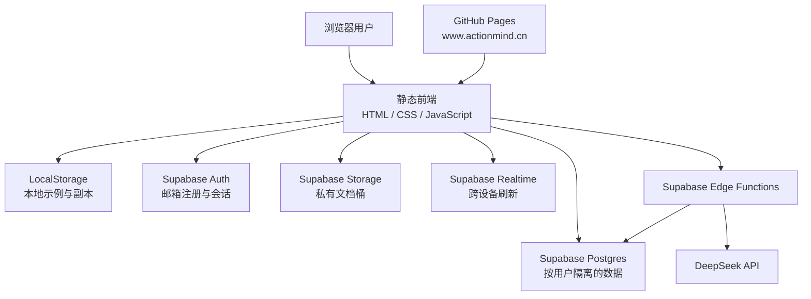
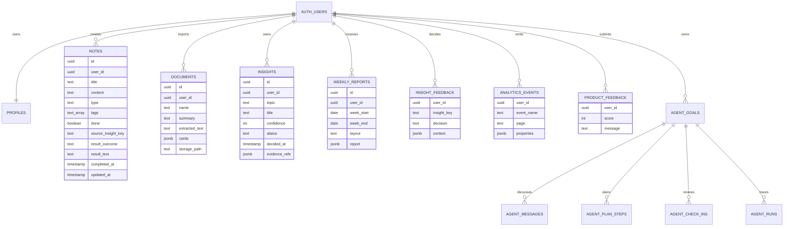

# Action 技术架构、测试、上线与迭代

> 目标：把架构、安全边界、验证结果和后续风险放在一份文档中，避免分别维护技术方案、测试报告、上线清单和路线图。

## 1. 当前系统架构

### 前端

- 技术：原生 HTML、CSS、JavaScript；
- 部署：GitHub Pages；
- 线上地址：<https://www.actionmind.cn/>；
- 域名解析：`www.actionmind.cn` 通过 CNAME 指向 GitHub Pages，仓库保留 `CNAME` 文件；
- 本地运行：`python3 -m http.server 6002`；
- 文档解析：pdf.js 与 Mammoth 在浏览器执行；
- 本地模式：LocalStorage 保存示例和本机数据。

### 云端

- 项目：Supabase，区域为新加坡；
- Authentication：邮箱密码、六位邮箱验证码、会话恢复；
- Database：Postgres + RLS；
- Storage：私有桶 `action-documents`；
- Realtime：notes、documents、insights、weekly_reports 与 Agent 目标/消息/步骤/检查表；
- Edge Functions：`analyze-insights`、`agent-orchestrate`、`generate-weekly`、`ask-action`、`admin-analytics`、`delete-account`；
- 模型：DeepSeek `deepseek-v4-flash`。

## 2. 数据模型

核心关系通过 `user_id` 归属用户。洞察引用以 `evidence_refs` JSON 保存记录/文档 ID，行动使用 `notes.type = task` 表示并保留来源洞察与结果字段。Agent 行动额外保存 `agent_goal_id` 和 `agent_step_id`，从而在用户完成行动时同步计划进度。前端会把文档提取文本同步到 `documents.extracted_text`，AI 默认读取摘要和关键词以减少不必要的传输与模型成本。

## 3. 数据流

### 保存输入

1. 前端先更新当前状态并写入本地副本；
2. 云端用户通过 Supabase SDK 写入 notes 或 documents；
3. Realtime 通知其他已登录设备；
4. 其他设备重新拉取工作区并刷新导航数字和页面内容。

### 运行 AI 洞察

1. 前端携带用户访问令牌调用 `analyze-insights`；
2. Edge Function 验证会话；
3. 查询最近 14 天、只属于当前用户的 notes/documents；
4. 调用 DeepSeek 并校验 JSON；
5. 写入 insights；
6. 同步调用周报生成并刷新页面。

### 推进 Agent 目标

1. 前端携带用户会话调用 `agent-orchestrate`；
2. Edge Function 读取目标、对话、当前计划与用户自己的近期材料；
3. 信息不足时只写入澄清问题，不创建行动；
4. 信息足够时写入 `proposed` 计划，并把目标置为 `ready`；
5. 用户确认后，服务端创建带目标/步骤关联的行动和阶段检查；
6. 用户完成行动或提交反馈后，同步步骤状态，并按需生成待再次确认的新计划版本；
7. Agent 进度进入工作台和周报上下文。

### 导入文档

1. 浏览器检查格式和大小；
2. 在本地提取文本并生成摘要、关键词和内容卡片；
3. 云端用户把原文件上传到私有桶；
4. 提取文本、摘要、关键词、卡片和存储路径写入 documents；
5. 后续 AI 主要读取文档摘要与关键词，降低不必要的传输和模型成本。

## 4. 安全与隐私

### 已实施

- 所有业务表启用 Row Level Security；
- select/insert/update/delete 都限制为 `auth.uid() = user_id`；
- profiles 只能由本人访问；
- 私有文件路径第一段为用户 ID；
- Storage 策略限制用户只能访问自己的目录；
- Edge Functions 校验 Authorization 会话；
- DeepSeek API Key 只存在 Supabase Secrets；
- 浏览器只包含可公开的 Supabase Publishable Key；
- 文件桶限制为 20 MB 和允许的 MIME 类型；
- AI 对话只查询当前用户数据。
- Agent 的计划审批和行动创建在 Edge Function 内完成，前端不能绕过确认状态；
- 注册邮件通过已验证的 `auth.actionmind.cn` 域名发送六位验证码；

### 仍需外部验证或运营能力

- 敏感信息检测与日志脱敏审计；
- 邮件送达率、退信率和频率限制的持续监控；
- 数据备份、恢复演练和正式事故响应流程；
- DeepSeek 数据保留条款的正式核查与用户告知。

## 5. 测试矩阵

| 模块 | 已完成验证 | 仍需验证 |
| --- | --- | --- |
| 静态前端 | 页面可运行；桌面与 Pixel 7 主路径 E2E；无横向溢出；结构静态测试 | 截图像素级回归、Safari/Firefox 更多版本 |
| 注册登录 | 注册成功反馈、登录/注册切换、验证邮件提示 | 新邮箱全流程自动化、邮件送达率 |
| 本地数据 | 创建、编辑、删除、完成与恢复 | 大量数据性能、版本迁移 |
| 文档导入 | PDF/DOCX 浏览器解析、卡片展示、云端上传 | 扫描 PDF、复杂表格、超长文档 |
| 洞察 | DeepSeek 结构化样例、空输入、结构容错、反馈持久化、6 组基础评测 | 50 组以上人工标注集、真实账号定期回归 |
| AI 对话 | 服务端调用成功、返回回答/依据/下一步、用户内容不作为系统指令 | 多轮上下文、独立安全测试 |
| 行动 Agent | 目标澄清、计划生成、确认前不建任务、确认后同步任务、完成状态回写、桌面/手机 E2E | 真实长期目标的计划质量、复杂重规划与外部工具调用 |
| 周报 | 服务端生成、动态布局、多周历史、周期趋势 | 极端内容量和规模化事实一致性 |
| 云端同步 | 表、私有存储、RLS、Realtime 已部署 | 两设备并发编辑冲突、离线恢复 |
| GitHub Pages | 自定义域名可访问，静态资源正常 | 持续部署检查、缓存失效策略 |

## 6. 发布前检查清单

### 功能

- [ ] 注册、验证、登录、退出均可完成；
- [x] 新用户能完成“3 条输入 → 洞察 → 行动 → 周报”的本地自动化路径；
- [x] 用户能完成“目标 → 澄清 → 确认计划 → 行动”的本地与云端 Agent 路径；
- [x] 导航数字在创建、导入、完成后实时更新；
- [x] AI 失败时不丢数据、不显示伪成功；
- [x] 桌面与手机主路径无横向溢出和文本遮挡；
- [ ] 使用全新真实邮箱定期回归验证邮件与跨设备路径。

### 安全

- [x] 仓库中不存在 service role key、数据库密码和 DeepSeek Key；
- [ ] RLS 与 Storage 策略在匿名用户、用户 A、用户 B 三种身份下验证；
- [x] Edge Functions 不接受无效会话；
- [x] Agent 未确认计划不会创建行动；
- [x] CORS 只允许本地开发地址和正式域名；
- [ ] 错误日志不输出用户完整正文。

### 内容与合规

- [x] 产品明确说明 AI 可能出错且最终判断属于用户；
- [x] 提供隐私说明、服务条款、完整导出和账户删除；
- [ ] 保留 Memos 灵感来源和 MIT 归属说明；
- [ ] 对外材料不夸大真实用户量、留存和 AI 准确率。

## 7. 运维与故障处理

### 常见故障

| 现象 | 优先检查 | 用户侧降级 |
| --- | --- | --- |
| 登录失败 | 邮箱是否验证、Supabase Auth 日志、频率限制 | 显示明确原因，保留输入 |
| AI 无响应 | Edge Function 日志、DeepSeek Secret、额度和 CORS | 保留原洞察，提示稍后重试 |
| 数据未同步 | 会话、Realtime 订阅、RLS 和网络 | 使用本地副本，允许手动刷新 |
| 文档解析失败 | MIME、大小、pdf.js/Mammoth 加载 | 保存文件状态，允许重新导入 |
| 周报内容异常 | 本周数据范围、洞察状态、模型 JSON | 使用前端规则布局和已有主题 |

### 回滚原则

- 前端通过 Git 提交回滚到上一稳定版本；
- 数据库迁移只追加可逆变更，不直接删除生产字段；
- Edge Function 可单独重新部署上一版本；
- 任何回滚不得覆盖用户 notes/documents 原始数据。

## 8. 迭代路线图

### 已完成：核心闭环技术验证

- 主链路埋点与按日漏斗视图；
- 基础洞察证据与安全评测集；
- 洞察确认/驳回状态写回云端并进入下一轮生成；
- 本地主路径桌面/手机自动化 E2E；
- 用户完整导入导出、账户删除、隐私说明和服务条款；
- 多周周报历史、趋势对比和行动结构化结果反馈。
- 个人行动 Agent 的目标澄清、计划审批、行动同步、阶段检查和重新规划；
- 自定义发件域名、SMTP 和六位邮箱验证码；
- `www.actionmind.cn` 自定义域名上线。

### P0：证明真实用户价值

- 5-10 名目标用户可用性测试与 4 周留存观察；
- 50 组以上人工标注 AI 评测集；
- 新邮箱验证、两设备同步和模型调用的定期回归；
- 用真实漏斗验证洞察到行动的转化和完成率。
- 用真实目标验证 Agent 计划确认率、首步完成率和重规划有效性。

### P1：提高长期价值

- 服务端文档解析和扫描件 OCR；
- 邮件送达率、退信与频控监控；
- Agent 日历、提醒与外部工具能力，前提是逐项授权并保留人工确认。

### P2：验证扩展方向

- 定时周报和轻提醒，前提是用户研究证明需要；
- 可控的只读分享；
- 外部工具导入；
- 团队协作，仅在个人闭环得到留存验证后考虑。

## 9. 当前上线结论

当前版本已经具备可公开体验的前端、六位验证码云端账户、用户数据隔离、私有文件、实时同步、服务端 DeepSeek 与个人行动 Agent，可以作为作品集产品和小规模测试版本使用。

技术闭环已经包含埋点、基础 AI 评测、主路径自动化测试、数据控制和合规页面。它仍不能被描述为“市场验证完成”：真实用户留存、规模化 AI 质量基准、邮件送达率、跨浏览器兼容和正式运维能力仍需验证。
